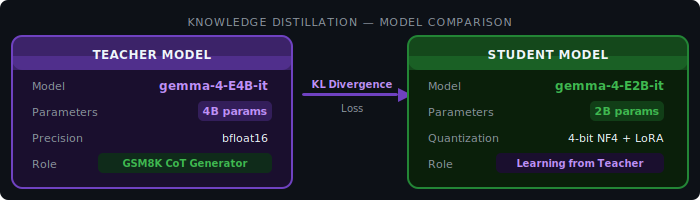

# Knowledge Distillation — gemma-4-E4B-it → gemma-4-E2B-it

[](https://heyneo.so)
[](https://marketplace.visualstudio.com/items?itemName=NeoResearchInc.heyneo)

> This project was autonomously built using **NEO** — Your autonomous AI Agent. [Try NEO →](https://heyneo.so)

---

## 🔄 Training in Progress


> **Notice:** This distillation run is currently active. All architecture and configuration details below are final. The Results section will be updated automatically once training completes.

| Field | Status |
|---|---|
| Run status | 🟡 Running |
| Teacher model | `google/gemma-4-E4B-it` (loaded, generating traces) |
| Student model | `google/gemma-4-E2B-it` + LoRA (training) |
| Expected output | `/app/ml_project_0924/hf_exports/gemma-e2b-distilled-lora/` |
| Results | Pending — see placeholder table in Results section |

---

## Overview

This task transfers reasoning capability from a larger teacher model to a smaller student model using **knowledge distillation** on the **GSM8K** grade-school math benchmark. The teacher, **google/gemma-4-E4B-it** (~4B parameters), generates chain-of-thought (CoT) reasoning traces which the student, **google/gemma-4-E2B-it** (~2B parameters), is trained to reproduce. The student is adapted via LoRA (r=16, alpha=32) rather than full fine-tuning, keeping the distillation compute-efficient.

The combined loss function aligns the student both to the teacher's output **distribution** (KL divergence over logits) and to the **final answer tokens** (cross-entropy), encouraging faithful CoT reproduction alongside correct answer prediction.

| Field | Value |
|---|---|
| Teacher model | `google/gemma-4-E4B-it` |
| Teacher parameters | ~4B (effective) |
| Student model | `google/gemma-4-E2B-it` |
| Student parameters | ~2B (effective) |
| Dataset | GSM8K |
| Teacher CoT traces | 50 (used for student training) |
| Training epochs | 3 |
| Test set | 20 GSM8K samples |

---

## Architecture

### Distillation Pipeline Diagram

```svg


```

### Model Comparison



### Loss Function Detail

The total training loss combines two objectives:

```
L_total = λ · L_KL + (1 - λ) · L_CE

where:
  L_KL = KL( softmax(z_student / T) || softmax(z_teacher / T) )   # distribution alignment
  L_CE = CrossEntropy( student_logits, final_answer_tokens )        # answer correctness
  T    = temperature (soft labels)
  λ    = weighting hyperparameter
```

| Component | Targets | Purpose |
|---|---|---|
| KL divergence | Full token distribution | Align student reasoning style to teacher |
| Cross-entropy | Final answer tokens only | Ensure correct numerical answers |

---

## Training Setup

### Teacher Configuration

| Parameter | Value |
|---|---|
| Model | `google/gemma-4-E4B-it` |
| Precision | bfloat16 |
| Role | Frozen — inference only |
| Output | 50 CoT traces + per-token logits |

### Student Configuration

| Parameter | Value |
|---|---|
| Base model | `google/gemma-4-E2B-it` |
| LoRA rank (`r`) | 16 |
| LoRA alpha (`alpha`) | 32 |
| Target modules | `q_proj`, `k_proj`, `v_proj`, `o_proj` |
| Trainable parameters | LoRA matrices only |
| Training epochs | 3 |

### Dataset

| Split | Samples | Source |
|---|---|---|
| Training (CoT traces) | 50 | GSM8K — teacher-generated |
| Evaluation | 20 | GSM8K test set |

Teacher traces are generated in advance using greedy decoding from `gemma-4-E4B-it`. Each trace contains the full chain-of-thought reasoning followed by the final numerical answer. Per-token logits from the teacher are stored alongside each trace and used as soft targets during student training.

---

## Results

> **Training in progress** — metrics will be populated once the run completes.

### GSM8K Accuracy (20 test samples)

| Model | Accuracy |
|---|---|
| Teacher (`gemma-4-E4B-it`) | ⏳ baseline pending |
| Student before distillation | ⏳ baseline pending |
| Student after distillation | ⏳ Results coming soon |
| Accuracy delta (vs pre-distillation) | ⏳ Results coming soon |

### BLEU Score vs Teacher Traces

| Metric | Value |
|---|---|
| BLEU-1 | ⏳ Results coming soon |
| BLEU-2 | ⏳ Results coming soon |
| BLEU-4 | ⏳ Results coming soon |
| ROUGE-L | ⏳ Results coming soon |

### Training Dynamics

| Epoch | Train Loss (KL) | Train Loss (CE) | Total Loss |
|---|---|---|---|
| 1 | ⏳ pending | ⏳ pending | ⏳ pending |
| 2 | ⏳ pending | ⏳ pending | ⏳ pending |
| 3 | ⏳ pending | ⏳ pending | ⏳ pending |

---

## Model Exports

### HuggingFace Export Path

```
/app/ml_project_0924/hf_exports/gemma-e2b-distilled-lora/
├── adapter_config.json
├── adapter_model.safetensors
├── tokenizer.json
├── tokenizer_config.json
└── README.md
```

The export contains only the LoRA adapter. To use the distilled student model, load the base `google/gemma-4-E2B-it` and apply the adapter.

---

## Usage

### Loading the Distilled Student

```python
from transformers import AutoModelForCausalLM, AutoTokenizer
from peft import PeftModel
import torch

base_model_id = "google/gemma-4-E2B-it"
adapter_path = "/app/ml_project_0924/hf_exports/gemma-e2b-distilled-lora/"

tokenizer = AutoTokenizer.from_pretrained(base_model_id)
base_model = AutoModelForCausalLM.from_pretrained(
    base_model_id,
    torch_dtype=torch.bfloat16,
    device_map="auto",
)

model = PeftModel.from_pretrained(base_model, adapter_path)
model.eval()
```

### Running a GSM8K-Style Inference

```python
problem = "Janet has 3 apples. She buys 5 more. How many apples does she have?"

prompt = f"Solve step by step:\n{problem}\n\nSolution:"

inputs = tokenizer(prompt, return_tensors="pt").to(model.device)
with torch.no_grad():
    outputs = model.generate(
        **inputs,
        max_new_tokens=256,
        temperature=0.0,       # greedy — match teacher eval protocol
        do_sample=False,
    )
print(tokenizer.decode(outputs[0], skip_special_tokens=True))
```

### Comparing Student vs Teacher Output

```python
from transformers import AutoModelForCausalLM

teacher_model = AutoModelForCausalLM.from_pretrained(
    "google/gemma-4-E4B-it",
    torch_dtype=torch.bfloat16,
    device_map="auto",
)

# Run same prompt through both — compare CoT style and final answer
```

### Merging Adapter into Base Model (optional)

```python
merged_model = model.merge_and_unload()
merged_model.save_pretrained("./gemma-e2b-distilled-merged")
tokenizer.save_pretrained("./gemma-e2b-distilled-merged")
```

---

## How It Was Built

This project was autonomously designed and implemented by **NEO**, an AI agent that handles the full ML engineering lifecycle — including multi-model orchestration, trace generation, and distillation loop construction.

NEO performed the following steps for this task:

1. Selected the teacher/student pair based on the 4B → 2B compression target
2. Loaded the teacher (`gemma-4-E4B-it`) in bfloat16 and ran inference over 50 GSM8K problems to generate CoT traces with stored logits
3. Configured the student with PEFT LoRA (r=16, alpha=32) targeting all attention projections
4. Constructed the combined KL + cross-entropy loss, with KL applied over the full vocabulary distribution and CE applied only on final answer tokens
5. Instrumented the training loop for per-epoch loss decomposition (KL vs CE contributions)
6. Set up HuggingFace-format adapter export to `/app/ml_project_0924/hf_exports/gemma-e2b-distilled-lora/`
7. Configured evaluation against 20 held-out GSM8K test samples measuring accuracy and BLEU vs teacher traces

[](https://heyneo.so)
[](https://marketplace.visualstudio.com/items?itemName=NeoResearchInc.heyneo)

> [Try NEO →](https://heyneo.so)
